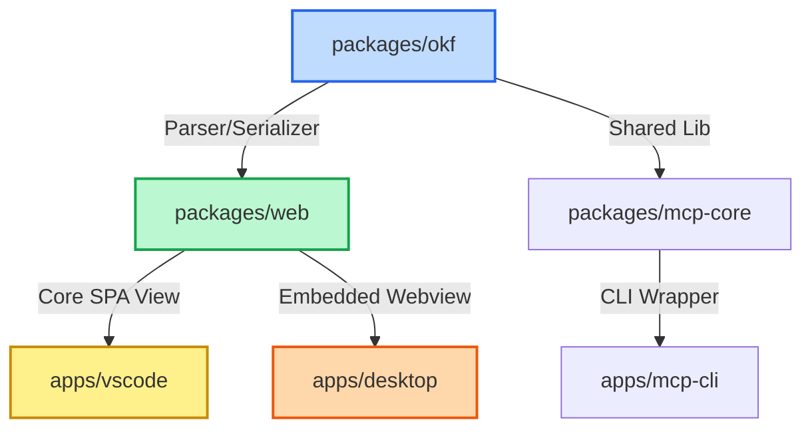

# ElDoc ERD Canvas


**ElDoc ERD Canvas** is a blazing-fast, strictly local, and completely free static web application for designing data models, entity-relationship diagrams (ERDs), and instantly generating SQL definitions using AI.

Built for modern developers and AI-native workflows, ElDoc ERD Canvas allows you to design schemas visually, export them to portable Markdown-based specifications, and expose them to AI agents via the Model Context Protocol (MCP).

---

## Architecture & Platform Offerings

ElDoc is built around a modern monorepo structure designed to be lightweight, zero-cost to host, and secure.



### 1. The Canvas Web App (`packages/web`)
A Static Single Page Application (SPA) powered by **React**, **Vite**, and **React Flow**. It runs 100% in-browser, requiring no database or backend. You can host it on Vercel, GitHub Pages, or Netlify for free, draw your ERDs, and export `.okf` bundles instantly.

### 2. VS Code Extension (`apps/vscode`)
Integrates the React ERD Canvas directly into your IDE. Drag-and-drop schema additions visually sync with a local `model.okf` file in your active workspace. This enables AI tools (such as Copilot, Claude Code, or Cursor) to read and generate code based on your latest visual diagrams.

### 3. Desktop Application (`apps/desktop`)
A standalone, lightweight desktop application bundled using **Tauri**. It embeds the Canvas SPA offline and runs locally, providing a secure workspace without internet requirements.

### 4. Developer CLI & MCP Server (`apps/mcp-cli` & `packages/mcp-core`)
A Node-based CLI that implements the Model Context Protocol (MCP). It exposes your ERD schema directly to AI agents (like Claude Desktop, Cursor, etc.), enabling automated query generation, FK join suggestions, and documentation.

---

## Key Features

- **Rich Field-Level Canvas**: View columns, primary/foreign keys, types, and descriptions in a structured table layout rather than simple bounding boxes.
- **Portability via OKF**: Complete import and export of model definitions in the Open Knowledge Format.
- **Precise Path Alignment**: Cardinality pills (`1` and `*`) follow Bezier, Step, and Straight lines mathematically, staying perfectly aligned even in complex models.
- **Anonymous-First & Private**: No authentication or cloud database required. Everything is kept locally. An optional ElDoc API key is only needed to push models to the ElDoc web catalog.
- **AI-Powered Workflows**: Copy AI system prompts or connect directly via the MCP server to co-author diagrams with LLMs.

---

## Project Structure

```bash
 apps
    desktop              # Tauri standalone desktop wrapper
    mcp-cli              # Node CLI for running the MCP server
    vscode               # VS Code extension hosting the webview canvas
 packages
    mcp-core             # Core MCP tool registry and handler logic
    okf                  # Shared library for parsing & serializing OKF Markdown
    web                  # React + Vite canvas web application
 tsconfig.base.json       # Base TypeScript configuration
 pnpm-workspace.yaml      # Monorepo workspace configuration
 package.json             # Root monorepo scripts and dependencies
```

---

## Local Development & Getting Started

The project uses **pnpm workspaces** for dependency management.

### Prerequisites
- Node.js (v18+)
- pnpm (v8+)

### 1. Clone & Install Dependencies
```bash
git clone https://github.com/your-repo/eldoc-erd-canvas.git
cd eldoc-erd-canvas
pnpm install
```

### 2. Build Shared Libraries
Before running the web app or extensions, compile the shared parsing libraries:
```bash
pnpm --filter @mc/okf build
pnpm --filter @mc/mcp-core build
```

### 3. Spin Up the Web Canvas
Start the local Vite development server:
```bash
pnpm dev:web
```
Open [http://localhost:5173](http://localhost:5173) in your browser.

### 4. Running the VS Code Extension
1. Open the project in VS Code.
2. Go to the **Run and Debug** tab (`Ctrl+Shift+D`).
3. Select **Launch VSCode Extension** and press `F5` to open a new Extension Development Host window.

### 5. Running the Desktop App (Tauri)
To run the Tauri desktop application in dev mode:
```bash
pnpm --filter @mc/desktop tauri dev
```

---

## Open Knowledge Format (OKF)

ElDoc Canvas reads and writes model definitions using the **[Open Knowledge Format](https://github.com/GoogleCloudPlatform/knowledge-catalog)**. 

### What is OKF?
OKF is a text-based, version-control-friendly standard that represents databases/marts as a folder of Markdown documents containing:
1. **YAML Frontmatter**: Metadata like descriptions, tags, and authors.
2. **Schema Tables**: Structured markdown tables listing columns, types, descriptions, roles (`pk`, `fk`), and security settings (`pii`).
3. **Joins**: A section specifying references and relationships between tables.

Because OKF uses standard Markdown, you can commit it to Git, review diagram adjustments via pull requests, and let LLM assistants read/write your diagrams natively. Refer to [`/okf-format.md`](packages/web/public/okf-format.md) inside `packages/web/public` for the exact layout structure.

---

## 🤖 Model Context Protocol (MCP) Integration

The CLI exposes an MCP server that lets AI models inspect, understand, and write SQL queries for your canvas diagrams.

### Running the MCP CLI
To start the MCP server locally over standard input/output (stdio):
```bash
npx eldoc-mcp
```
*(Or run `node apps/mcp-cli/dist/index.js` after compiling the monorepo).*

### Exponentiable Tools Provided

The server registers 5 main tools for LLM integration:

1. **`generate_sql`**: Translates your ERD canvas model into SQL DDL schema commands.
   - **Arguments**: `graphJson` (string), `dialect` (string, e.g. `'postgres' | 'snowflake' | 'bigquery'`)
2. **`get_business_context`**: Pulls Glossary terms and Key Performance Indicators (KPIs) to help LLMs understand the semantic context.
   - **Arguments**: `graphJson` (string)
3. **`list_tables`**: Lists all tables, data sources, and descriptions.
   - **Arguments**: `graphJson` (string)
4. **`describe_table`**: Extracts detailed metadata (columns, roles, PII tags) for a target table.
   - **Arguments**: `graphJson` (string), `tableName` (string)
5. **`suggest_joins`**: Heuristically matches columns (`_id` patterns, PK/FK roles) to suggest relational joins.
   - **Arguments**: `graphJson` (string)

### Desktop Integration Setup (e.g. Claude Desktop)
Add this to your `claude_desktop_config.json` configuration file:
```json
{
  "mcpServers": {
    "eldoc-modeler": {
      "command": "node",
      "args": ["C:/absolute/path/to/eldoc-erd-canvas/apps/mcp-cli/dist/index.js"]
    }
  }
}
```

---

## 🧪 Testing

The repository uses **Vitest** for running unit and component tests.

Run tests across all workspaces:
```bash
pnpm -r test
```

To run tests in watch mode for a single workspace package (e.g. `@mc/web`):
```bash
pnpm --filter @mc/web test
```

---

## Deployment

The production static build can be deployed anywhere that serves static assets.

```bash
# Build the packages & bundle the React SPA
pnpm build
```
Deploy the resulting static build output located in `packages/web/dist`.

---

## 🤝 Contributing

We welcome contributions! Please review our [CONTRIBUTING.md](CONTRIBUTING.md) for local setup, styling policies, and PR review cycles. All participants must follow the [Code of Conduct](CODE_OF_CONDUCT.md).

For reporting security vulnerabilities privately, please follow the guidelines in [SECURITY.md](SECURITY.md).

---

## License

Distributed under the [Apache License 2.0](LICENSE). See [NOTICE](NOTICE) for copyright and attribution.

> **Note**: "Open Knowledge Format (OKF)" is an open specification published by Google. ElDoc ERD Canvas reads and writes that format but is an independent, community-driven project — not affiliated with or endorsed by Google.
