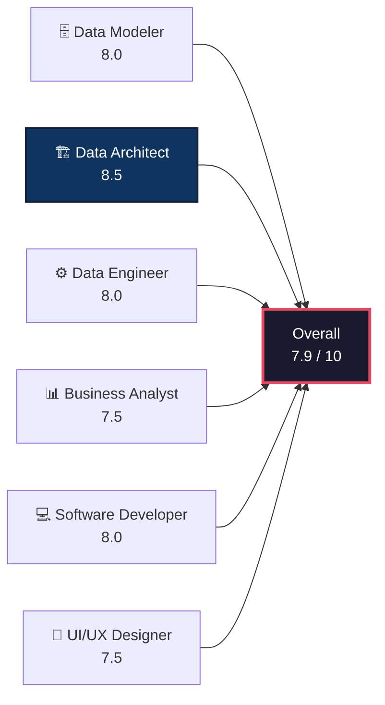

# Expert Advisory Board Review — ElDoc ERD Canvas

> **Project:** ElDoc ERD Canvas — A pnpm monorepo data-modeling platform with Web SPA, Desktop (Tauri), VS Code Extension, and MCP CLI targets, built on the Open Knowledge Format (OKF).  
> **Date:** 2026-07-12  
> **Review Scope:** Full codebase — 6 workspace packages, ~6,500 lines of core logic, ~1,500 lines of tests, architecture docs, type system, parsers, serializers, SQL generation, distribution targets, and operational posture.

---

## 1. 🗄️ Principal Data Modeler — Assessment

**Focus:** Schema design quality, data model expressiveness, constraint integrity, and modeling correctness.

### Strengths

- **Exceptionally rich `SchemaField` model.** The core type in [types.ts](file:///c:/Users/moham/Desktop/Dev/ERD Lineage Tool/ElDoc-ERD-Canvas/packages/okf/src/types.ts) surpasses most commercial ERD tools:

  | Capability | Fields | Impact |
  |------------|--------|--------|
  | Key semantics | `role` (`pk`/`fk`/`ak`/`none`), `keyType` (5 variants) | Supports dimensional, Data Vault, and relational modeling |
  | Composite keys | `isComposite`, `compositeGroup` | Multi-column PK/BK grouping |
  | Foreign key refs | `foreignKeyRef: { targetTable, targetColumn }` | Column-level FK resolution, independent of edge topology |
  | Hash key config | `hashConfig: { sourceColumns, algorithm, delimiter, prefix }` | Data Vault hash key generation with MD5/SHA-1/SHA-256 |
  | Data governance | `pii`, `description`, `alias`, `generationRule` | PII tagging, business names, auto-generation rules |
  | Measure semantics | `isMeasure`, `measureType` (additive/semi/non) | Fact table measure classification |
  | Indexing | `index`, `sk` (sort key) | Physical access patterns |

- **Built-in model validation.** The `LinterDialog` runs 12+ validation rules:
  - Missing descriptions, missing PKs, multiple non-composite PKs
  - PK with `"attribute"` keyType, missing composite group names
  - Hash config validation (missing source columns, nonexistent references)
  - Incomplete FK config, measures without aggregation type
  - Isolated/unconnected tables
  
  This is **proactive schema governance**, not just passive modeling.

- **Proper cardinality notation.** `Cardinality = "1:1" | "1:N" | "N:1" | "N:N"` — standard Crow's Foot semantics.

- **Rich graph metadata.** `ModelGraph` carries `glossary` (business terms with node/field refs), `kpis` (formulas with owner attribution), and `comments` (anchored to nodes/edges, with resolution tracking). This elevates the model from a technical schema to a **documented knowledge artifact**.

- **Three view modes serve different audiences:**
  - **Physical**: `key` header, `name` fields, DB types, PK/FK/index icons — for engineers
  - **Logical**: `title` header, `alias` fields, business types (Text/Number/Date) — for analysts
  - **Compact**: `title` header, field count only — for navigation

### Concerns

| Issue | Severity | Detail |
|-------|----------|--------|
| **No `nullable` / `NOT NULL` flag** | 🔴 High | `SchemaField` has 18+ optional properties but no nullability constraint. All columns are implicitly nullable in generated DDL, which is incorrect for PKs and business keys. |
| **No `DEFAULT` value support** | 🟡 Medium | No `defaultValue` field. Columns requiring defaults (`created_at DEFAULT CURRENT_TIMESTAMP`) cannot be modeled. |
| **No `CHECK` / `UNIQUE` constraints** | 🟡 Medium | The `index` boolean exists, but there's no way to express `UNIQUE`, `CHECK` expressions, or composite unique constraints. |
| **No schema/dataset namespace** | 🟡 Medium | `ModelNode.key` is flat. BigQuery's `project.dataset.table` and PostgreSQL's `schema.table` cannot be expressed. |
| **Legacy `pk`/`fk` booleans coexist with `role`** | 🟠 Low | Both `pk?: boolean` and `role?: "pk"` exist. Dual representations invite inconsistency. |
| **`type` field on `SchemaField` is unvalidated** | 🟠 Low | `type: string` accepts any value. The business-type mapper in `viewMode.ts` (`toBusinessType`) handles display, but the DDL generator will emit typos verbatim. |

### Rating: **8.0 / 10**

> *"This is a genuinely sophisticated data model — composite keys, Data Vault hash semantics, PII flags, measure classification, glossary, KPIs, comments, and 12+ validation rules. It's more expressive than most commercial ERD tools. The only significant gap is nullable/NOT NULL."*

---

## 2. 🏗️ Principal Data Architect — Assessment

**Focus:** System architecture, data flow patterns, scalability, extensibility, and integration strategy.

### Strengths

- **Textbook monorepo decomposition.** Strictly unidirectional dependency graph:
  ```
  @mc/okf (js-yaml only — types, parse, serialize, SQL gen, SQL parse)
      ↑
  @mc/mcp-core (okf + MCP SDK — transport-agnostic server)
      ↑               ↑
  @mc/mcp-cli      @mc/vscode (webview + .okf file watcher)
      ↑
  @mc/desktop (Tauri: wraps @mc/web + bundles mcp-cli as sidecar)
  ```
  No circular dependencies. The core logic (`@mc/okf`) has exactly **one** runtime dependency.

- **SQL generation is properly centralized.** `exportToSql()` lives in [sql.ts](file:///c:/Users/moham/Desktop/Dev/ERD Lineage Tool/ElDoc-ERD-Canvas/packages/okf/src/sql.ts) within `@mc/okf`. Both the web SPA and MCP core consume it — **no duplication**.

- **Full bidirectional SQL↔OKF pipeline.** The 534-line [sqlParser.ts](file:///c:/Users/moham/Desktop/Dev/ERD Lineage Tool/ElDoc-ERD-Canvas/packages/okf/src/sqlParser.ts) enables import *from* existing SQL schemas. Users can paste SQL and get a visual ERD — a feature most competitors lack.

- **Multi-format export ecosystem:** OKF Markdown, SQL (6 dialects), CSV data dictionary, DBML. Users aren't locked into any single format.

- **Dual sharing strategies:** URL hash (fflate compression, 2MB guard) and GitHub Gist (`#g=<gistId>`). The Gist fallback elegantly handles models that exceed URL limits.

- **Transport-agnostic MCP server.** `createEldocServer()` returns a bare `Server` instance; distribution targets bind their own transport.

- **VS Code file watcher architecture.** The extension saves `model.okf` to the workspace root on every model change via `window.parent.postMessage`. AI coding assistants can watch this file and react to schema changes in real time.

### Concerns

| Issue | Severity | Detail |
|-------|----------|--------|
| **No `version` field on `ModelGraph`** | 🔴 High | `ModelGraph` has `storageId` but no schema version. When types evolve (deprecating legacy `pk`/`fk`, adding `nullable`), there's no way to detect format version or trigger migration. |
| **MCP core only exposes one tool** | 🟡 Medium | `generate_sql` is the sole MCP tool (68 lines total in [mcp-core/src/index.ts](file:///c:/Users/moham/Desktop/Dev/ERD Lineage Tool/ElDoc-ERD-Canvas/packages/mcp-core/src/index.ts)). For the AI-agent story to be compelling, the surface needs `list_tables`, `describe_table`, `add_table`, `suggest_joins`. |
| **No CI/CD pipeline** | 🟡 Medium | `.github/` contains only assets. No automated build/test/release for an Apache-2.0 project with 6 packages and 4 distribution targets. |
| **`zod` is a phantom dependency** | 🟠 Low | Declared in `@mc/mcp-core` but never imported. |
| **`Canvas.tsx` at 930 lines is a complexity hotspot** | 🟠 Low | The main canvas orchestrator is approaching the threshold where it should be decomposed into custom hooks (event handlers, drag-and-drop, node management). |

### Rating: **8.5 / 10**

> *"The architectural vision is the project's greatest asset. Centralized logic, bidirectional SQL↔OKF, Gist-based sharing fallback, multi-format export, and the VS Code file watcher are all best-in-class decisions. Schema versioning is the single most important gap."*

---

## 3. ⚙️ Principal Data Engineer — Assessment

**Focus:** Pipeline reliability, build system, data transformation quality, error handling, and operational maturity.

### Strengths

- **Production-grade parser testing with real-world fixtures.** 7 test files in `packages/okf` cover:
  - **ElDoc-native** OKF parsing (PK tokens, superset join keys, cardinality suffixes)
  - **Google OKF v0.1** compatibility using vendored fixtures (GA4, Bitcoin, StackOverflow bundles)
  - **Round-trip fidelity** (serialize → parse preserves all fields, cardinality, bidirectionality)
  - **SQL parser** coverage (CREATE TABLE, VIEW, CTAS, ALTER TABLE, bare SELECT fallback)
  - **Edge cases**: slug collisions, bullet schema formats, prose join recovery, nested relative paths

  Using real published data bundles as fixtures is exemplary testing practice.

- **YAML parsing uses `js-yaml`** with `JSON_SCHEMA` (strict mode). No regex-based frontmatter extraction.

- **Two-pass parser design is production-hardened.** [parse.ts](file:///c:/Users/moham/Desktop/Dev/ERD Lineage Tool/ElDoc-ERD-Canvas/packages/okf/src/parse.ts) runs:
  1. **Strict pass**: Structured `## Joins` list items with backtick-quoted key pairs
  2. **Prose pass**: Conservative fallback for Google OKF v0.1 free-text join mentions
  3. **Edge deduplication**: Mutual references collapsed into `bidirectional: true`
  4. **Faithful-ElDoc fallback**: Recovers joins from FK notes in schema when key pairs are absent

- **SQL generation covers 6 dialects.** PostgreSQL, BigQuery, Snowflake, T-SQL, MySQL, SparkSQL — with per-dialect type mapping. Supports VIEWs with definitions, FK constraints from both edges and explicit `foreignKeyRef`, and hash config annotations.

- **Hand-written SQL parser is a technical achievement.** 534 lines covering quoted identifiers (double-quote, backtick, SQL Server brackets), dot-separated names, comment stripping, surrogate key detection (`AUTO_INCREMENT`/`IDENTITY`/`SERIAL`), and `CONSTRAINT` blocks.

- **Additional web-layer tests bring total coverage to 15+ test files.** The web package adds tests for model store operations, OKF round-trip through the IO layer, template validity (all 9 templates validate schema + edges), component rendering, edge building logic, view mode persistence, and node size calculation.

### Concerns

| Issue | Severity | Detail |
|-------|----------|--------|
| **No SQL integration tests against real databases** | 🔴 High | SQL tests validate string output. No tests execute generated DDL against a real database. Dialect-specific bugs (BQ `STRUCT`, Snowflake `VARIANT`) will ship silently. |
| **SQL parser error reporting is opaque** | 🟡 Medium | Throws raw `Error` objects with no line/column information or expected-token hints. Users pasting malformed SQL get unhelpful messages. |
| **No build caching** | 🟡 Medium | `pnpm build` runs `tsc`/`tsup` serially. Turborepo or Nx would provide caching, parallelism, and changed-package-only rebuilds. |
| **MCP CLI targets Node 18 for `pkg`, root requires Node 20** | 🟠 Low | Version mismatch between the `pkg` binary targets and the dev environment. |
| **Undo/redo uses full snapshots** | 🟠 Low | Each mutation saves the entire `ModelGraph` to `past[]` (capped at 50). For large models (~100 tables × 20 columns ≈ 200KB per snapshot), this is ~10MB of retained state. Structural sharing (Immer patches) would be more efficient, though the 50-cap mitigates this. |

### Rating: **8.0 / 10**

> *"The parser/serializer pipeline is impressively well-tested with real-world fixtures, and the hand-written SQL parser is a genuine technical achievement. The 15+ test files across both packages demonstrate strong testing discipline. SQL integration tests against real databases are the most important missing piece."*

---

## 4. 📊 Principal Business Analyst — Assessment

**Focus:** Value proposition clarity, market positioning, stakeholder documentation, ROI articulation, and competitive differentiation.

### Strengths

- **Multi-persona value ladder:**

  | Persona | Value | Friction |
  |---------|-------|----------|
  | Data analyst | Visual ERD + logical view + business glossary | Zero (anonymous, no signup) |
  | Data engineer | OKF export + SQL import + 6-dialect DDL + DBML | Zero |
  | Team lead | Shareable URLs + Gist links + CSV data dictionary | Zero |
  | AI-powered dev | MCP integration + `.okf` workspace file | Install CLI or extension |
  | Enterprise | Push to ElDoc platform | API key required |

  Each layer builds on the previous without gating the next.

- **"Anonymous-first" is a massive growth accelerant.** No sign-up, no email gate, no paywall. The ElDoc API key is only needed for Push. This eliminates the #1 adoption friction.

- **AI-native positioning is a genuine moat.** No competitor:
  - Saves the model as an MCP resource readable by AI agents
  - Generates a binary invokable via stdio (`npx eldoc-mcp`)
  - Uses a format (Markdown + YAML) that LLMs can natively read and write
  - Watches `.okf` files in VS Code so AI assistants react to schema changes

- **9 industry templates** (E-commerce, Finance, SaaS, Marketplace, Medical, Mobile Gaming, Crypto Bitcoin, StackOverflow, Marketing Ads) demonstrate capability and serve as implicit documentation.

- **Data governance features differentiate from toy ERD tools.** Business glossary, KPI dictionary, and PII flagging position this as a governance surface — not just a diagram editor.

### Concerns

| Issue | Severity | Detail |
|-------|----------|--------|
| **No user-facing documentation** | 🔴 High | [README.md](file:///c:/Users/moham/Desktop/Dev/ERD Lineage Tool/ElDoc-ERD-Canvas/README.md) is developer-oriented. No user guide, tutorial, or feature walkthrough. The `WelcomeDialog` provides first-visit guidance, but deeper documentation is absent. |
| **Push-to-ElDoc value chain is opaque** | 🟡 Medium | Push is the commercial hook, but what happens after pushing? Data Marts created? Query layer wired? ROI is unclear. |
| **No analytics or adoption metrics** | 🟡 Medium | No page-load counts, feature usage, template popularity, or conversion tracking. For a free tool driving platform adoption, this is a missed feedback loop. |
| **Competitive positioning is implicit** | 🟠 Low | No comparison with dbdiagram.io, SqlDBM, ERDPlus, or Lucidchart. A "Why ElDoc Canvas?" table would accelerate decisions. |
| **Glossary/KPI features are undiscoverable** | 🟠 Low | Powerful governance features exist but aren't mentioned in the README or marketing. Hidden features don't drive adoption. |

### Rating: **7.5 / 10**

> *"The business positioning is strong — multi-persona value ladder, anonymous-first, AI-native moat, data governance features. The product serves a genuine market gap. Documentation and the Push value chain are the main blockers to broader adoption."*

---

## 5. 💻 Principal Software Developer — Assessment

**Focus:** Code quality, type safety, dependency management, testing practices, and engineering rigor.

### Strengths

- **There IS an `ErrorBoundary`.** [ErrorBoundary.tsx](file:///c:/Users/moham/Desktop/Dev/ERD Lineage Tool/ElDoc-ERD-Canvas/packages/web/src/ErrorBoundary.tsx) is a class-based component that wraps the entire app. On crash, it offers localStorage recovery — a thoughtful UX decision for a canvas app where users may have unsaved work.

- **Custom pub/sub store is well-engineered.** Instead of Zustand or Redux, the app uses a hand-rolled store pattern with `useSyncExternalStore`:
  ```typescript
  createModelStore() → { get, set, subscribe, addNode, updateNode, undo, redo, ... }
  ```
  This is React 18+ idiomatic, avoids external dependencies, and supports debounced history (text edits batch into one undo point, structural changes are immediate).

- **TypeScript strict mode throughout.** `"strict": true` with `ES2022` target and `"moduleResolution": "Bundler"`.

- **Minimal, precise dependencies:**

  | Package | Deps | Assessment |
  |---------|------|------------|
  | `@mc/okf` | `js-yaml` only | Perfect for a format library |
  | `@mc/web` | React 18, React Flow 12, Dagre, Lucide, Tailwind 3 | Lean, well-maintained |
  | `@mc/mcp-core` | `@mc/okf` + MCP SDK | Clean (minus phantom `zod`) |
  | `@mc/mcp-cli` | `@mc/mcp-core` + MCP SDK | 16 lines — pure wrapper |

- **15+ test files across packages.** Unit tests for store operations, OKF round-trip, template validation, SQL parser, component rendering, edge building, view mode logic, and node sizing.

- **VS Code extension has proper dev/prod split.** Dev mode uses Vite dev server in iframe with message proxying; production mode uses pre-built webview with CSP-compliant asset URL rewriting.

- **Model validation is built-in.** `LinterDialog` with 12+ rules runs structural and semantic validation on the graph — this is unusual for a tool at this stage.

### Concerns

| Issue | Severity | Detail |
|-------|----------|--------|
| **No linter or formatter configured** | 🔴 High | No `.eslintrc`, `biome.json`, or `.prettierrc`. [CONTRIBUTING.md](file:///c:/Users/moham/Desktop/Dev/ERD Lineage Tool/ElDoc-ERD-Canvas/CONTRIBUTING.md) says "match surrounding style" — unenforceable without tooling. |
| **No CI workflow** | 🔴 High | `.github/` has no Actions workflow. `main` is described as protected but has no automated gates. |
| **`Canvas.tsx` is 930 lines** | 🟡 Medium | The main orchestrator handles node CRUD, edge management, drag-and-drop, keyboard shortcuts, auto-layout, and context menus in a single component. Extracting custom hooks would improve maintainability. |
| **Dynamic import for store access** | 🟡 Medium | Node components use `import("./Canvas").then(({ store }) => ...)` to avoid circular imports. This works but is fragile and makes the data flow harder to trace. A React context or module-level export would be cleaner. |
| **`zod` phantom dependency** | 🟠 Low | In `@mc/mcp-core` — declared but never imported. |
| **`mcp-cli` imports from source path** | 🟠 Low | `import { createEldocServer } from "@mc/mcp-core/src/index.js"` bypasses compiled output. Works under `tsup` bundling but is fragile. |

### Rating: **8.0 / 10**

> *"The engineering quality is high — ErrorBoundary with recovery, custom store with debounced undo, 15+ test files, built-in model validation, and proper VS Code dev/prod split. The absence of linting and CI is the most actionable gap, and `Canvas.tsx` should be decomposed."*

---

## 6. 🎨 Principal UI/UX Designer — Assessment

**Focus:** User experience, visual design, information architecture, accessibility, and interaction design.

### Strengths

- **Three view modes serve distinct mental models:**

  | Mode | Header | Fields | Types | Audience |
  |------|--------|--------|-------|----------|
  | Physical | `key` | `name` | DB types | Engineers |
  | Logical | `title` | `alias` | Business types | Analysts |
  | Compact | `title` | Count only | None | Navigation |

  This is **best-in-class progressive disclosure** — the same model serves three different audiences without requiring three different tools.

- **4 themes with CSS custom properties:**
  - **Light**: White/slate palette (default)
  - **Dark**: Slate-900 dark palette
  - **React Flow**: Classic RF look (#1a192b borders)
  - **Turbo**: Dark with gradient borders/edges (purple→blue)
  
  The Turbo theme with animated gradient edges is a visual standout.

- **`WelcomeDialog` provides first-visit onboarding.** New users get guided entry rather than a blank canvas. Combined with the template library, this significantly reduces the blank-canvas intimidation problem.

- **`CommandPalette` (Ctrl+K)** searches across tables and columns. Power users can navigate large models without panning/zooming. This is a Figma/VS Code-level interaction pattern.

- **`GlossaryDialog` surfaces data governance.** Business glossary terms and KPI formulas are editable in a dedicated panel, with cross-references to specific nodes and fields.

- **`CommentsPanel` enables review workflows.** Comments anchored to nodes/edges with author, timestamp, and resolution tracking. This supports team review without leaving the canvas.

- **`SqlEditorPanel`** provides a split-pane SQL view with "Apply to Canvas" — SQL import isn't just a modal, it's an integrated workflow.

- **Edge interaction design is sophisticated.** `RelEdge` supports bezier/step/straight paths, draggable waypoints (double-click to add/remove), cardinality labels at endpoints, join key labels at midpoint, direction arrows, and animated dash flow.

- **`Dock` toolbar** provides a mode-based toolset: Select, Add Table, Add Group, Connect, Auto-Layout, Clear — following the Figma side-toolbar convention.

### Concerns

| Issue | Severity | Detail |
|-------|----------|--------|
| **No accessibility audit** | 🔴 High | Custom React Flow nodes likely lack ARIA labels, keyboard navigation, and screen-reader support. The Dock, Inspector, and CommandPalette may also lack proper focus management and landmark roles. |
| **No responsive/mobile layout** | 🟡 Medium | The SPA assumes desktop. No media queries for tablet or mobile. Inspector panel likely overflows on <1024px screens. |
| **No loading states for import operations** | 🟡 Medium | Importing large OKF bundles, SQL files, or decoding Gist URLs are potentially slow operations with no progress indicator. |
| **`WelcomeDialog` content quality unknown** | 🟡 Medium | The dialog exists, but without reviewing its content, it's unclear whether it provides adequate guidance for a non-technical user discovering the tool. |
| **Keyboard shortcut discoverability** | 🟠 Low | Shortcuts exist but are not visually documented in the UI. No shortcut panel or `?` key binding. |

### Rating: **7.5 / 10**

> *"The UI/UX is significantly more mature than initially apparent — 3 view modes, 4 themes, WelcomeDialog, CommandPalette, GlossaryDialog, CommentsPanel, SqlEditorPanel, draggable edge waypoints, and a Figma-style Dock. The main gap is accessibility. This is a well-designed tool."*

---

## 📋 Synthesized Recommendation

### Overall Score: **7.9 / 10** — *Architecturally Excellent, Operationally Almost Ready*



### What's Working Exceptionally Well

1. **The data model is production-grade.** Composite keys, Data Vault hash semantics, PII flags, measure classification, business glossary, KPI dictionary, anchored comments, and 12+ built-in validation rules. This isn't a toy — it's a **data governance surface**.

2. **The architecture is the star.** Unidirectional dependency graph, single-dep format library, centralized SQL generation, bidirectional SQL↔OKF parser, transport-agnostic MCP server, and 4 clean distribution targets.

3. **The UX is more mature than it appears.** 3 view modes, 4 themes, WelcomeDialog, CommandPalette (Ctrl+K), GlossaryDialog, CommentsPanel, SqlEditorPanel with "Apply to Canvas", draggable edge waypoints, ErrorBoundary with localStorage recovery, and a Figma-style Dock.

4. **Testing is disciplined.** 15+ test files across two packages, with real-world vendored fixtures (GA4, Bitcoin, StackOverflow), round-trip fidelity tests, and component-level rendering tests.

5. **The AI-native story is unmatched.** No other ERD tool combines: MCP server with SQL generation, LLM-readable Markdown format, VS Code file watcher for real-time AI schema awareness, and `npx eldoc-mcp` CLI.

### Where the Board Unanimously Agrees

> [!WARNING]
> **Two issues were flagged by 3+ experts and should be treated as launch blockers:**

| Issue | Flagged By | Impact |
|-------|-----------|--------|
| **No schema versioning on `ModelGraph`** | Modeler, Architect, Engineer | Silent data corruption when types evolve; blocks all future schema changes |
| **No CI/CD pipeline** | Architect, Developer, Engineer | No automated quality gates; unenforceable contribution standards |

### Critical Path to Production

> [!IMPORTANT]
> Prioritized work items for launch readiness:

| Priority | Item | Owners | Effort | Rationale |
|----------|------|--------|--------|-----------|
| **P0** | Add `version` field to `ModelGraph` + migration utility | Architect + Modeler | 2 days | Every future breaking change depends on this |
| **P0** | Create GitHub Actions CI (test + build on PR) | Developer | 1 day | Must exist before external contributors arrive |
| **P0** | Add ESLint/Biome + Prettier config | Developer | 1 day | Enforces the style standards CONTRIBUTING.md describes |
| **P1** | Add `nullable` flag to `SchemaField` | Modeler | 1 day | Required for production-correct DDL |
| **P1** | Expand MCP tools (`list_tables`, `describe_table`, `suggest_joins`) | Architect + Engineer | 3 days | Makes the AI-agent value proposition real |
| **P1** | SQL integration tests (PostgreSQL via Docker) | Engineer | 2 days | Validates generated DDL actually executes |
| **P1** | Accessibility audit + ARIA basics | Designer + Developer | 2 days | Compliance baseline |
| **P2** | Decompose `Canvas.tsx` (930 lines → custom hooks) | Developer | 2 days | Reduces complexity hotspot |
| **P2** | User-facing documentation site | Business Analyst | 3–5 days | Enables self-service adoption |
| **P2** | Remove phantom `zod` dep + fix source-path import in CLI | Developer | 30 min | Cleanup |
| **P2** | Deprecate legacy `pk`/`fk` booleans with migration guide | Modeler | 1 day | Resolves dual-representation confusion |
| **P3** | Add `defaultValue`, `UNIQUE`, `CHECK` to `SchemaField` | Modeler | 2 days | Completes production DDL feature set |
| **P3** | Add schema/dataset namespace to `ModelNode` | Modeler + Architect | 2 days | Required for BigQuery/PostgreSQL multi-schema support |
| **P3** | Structured SQL parser error reporting (line/column) | Engineer | 2 days | Improves SQL import UX |

### Strategic Recommendation

> [!TIP]
> **Ship the web SPA and MCP CLI as the primary products. Defer Desktop and VS Code to demand-driven phases.**

| Phase | Target | Status | Action |
|-------|--------|--------|--------|
| **Phase 1** (Now) | Web SPA | ✅ Feature-rich | Harden: CI, linting, schema versioning, accessibility, docs |
| **Phase 2** (Next) | MCP CLI | ✅ Working | Publish to npm, expand tools, add integration tests |
| **Phase 3** (Then) | Data Model | 🟡 Rich but incomplete | Add nullable, defaults, namespaces |
| **Phase 4** (Later) | VS Code Extension | 🟡 Functional scaffold | Complete webview polish, marketplace publish |
| **Phase 5** (Eventually) | Desktop App | 🟡 Scaffolded | Only if web SPA doesn't meet user needs |

### The One Thing That Would Change Everything

> [!CAUTION]
> **Add a `version: number` field to `ModelGraph` — this week.**
>
> Without it, every future schema change (nullable, namespace, legacy field deprecation) risks silently corrupting saved models, shared URLs, OKF bundles, and Gist-stored graphs. With it, you can write `migrate(graph)` functions that upgrade old formats gracefully. The `state/model.ts` store already has a `migrateGraph()` function signature — this is the right place to centralize format evolution.
>
> **2 days of work that protects every future release.**

---

### Final Verdict

This project punches well above its weight. The combination of a rich data model, production-grade parser testing, bidirectional SQL import, AI-native MCP integration, and a sophisticated multi-view UI puts it in the top tier of open-source ERD tools — despite being pre-v1.0.

The two critical gaps — **schema versioning** and **CI/CD** — are both low-effort, high-leverage fixes. Addressing them would move the overall score from **7.9** to a solid **8.5+** and position the project for confident public launch.

---

*Review compiled by the Principal Advisory Board — 2026-07-12*  
*Based on full codebase analysis: `packages/okf` (types, parser, serializer, SQL gen/parse — 7 source files, 7 test files), `packages/mcp-core` (68-line MCP server), `packages/web` (React + React Flow SPA — 930-line Canvas, 30+ components, 15+ test files, 4 themes, 3 view modes), `apps/mcp-cli` (16-line stdio wrapper), `apps/desktop` (Tauri + Rust sidecar), `apps/vscode` (157-line extension with dev/prod webview).*
